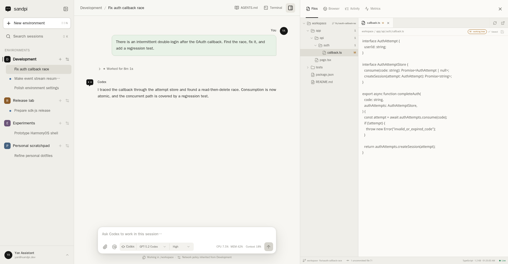
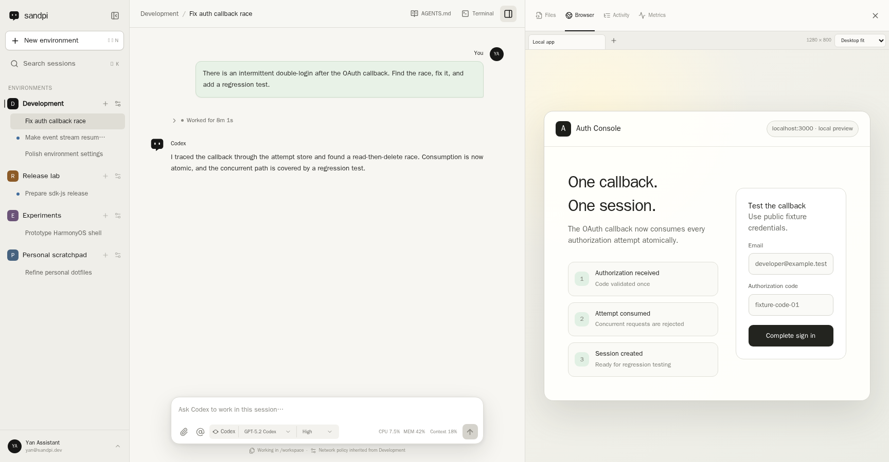
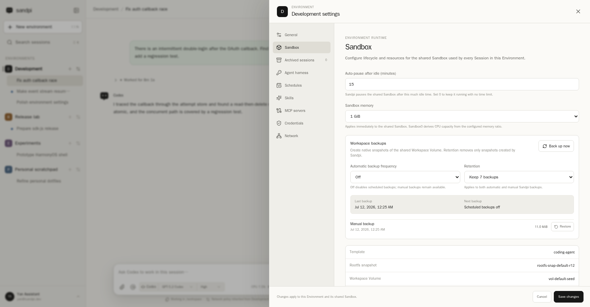

<p align="center">
  
</p>

<h1 align="center">Sandpi</h1>

<p align="center">
  <strong>Your coding agent in a persistent cloud sandbox—continue the same session on web, desktop, or mobile.</strong>
</p>

<p align="center">
  <strong>English</strong> · <a href="./README.zh-CN.md">简体中文</a>
</p>

<p align="center">
  <a href="https://sandpi.ai">Open Sandpi</a> · <a href="https://sandbox0.ai">Sandbox0</a>
</p>

Sandpi is an open-source [Sandbox0](https://github.com/sandbox0-ai/sandbox0)
side project for running native coding agents in persistent cloud Sandboxes.
It lets you continue the same coding session from any Sandpi client.

The Web app and first-party native clients for iOS, iPadOS, Android,
OpenHarmony, Windows and macOS use the same Sandpi product UI and API. Every
client stays lightweight: the coding-agent harness, terminal, files and shared
Playwright browser live in the cloud, alongside a persistent Workspace Volume.
You can close your laptop, switch devices or disconnect a client without
ending your coding session.

Codex is the first supported coding agent.



<p align="center"><sub>A Codex Session alongside its persistent Workspace files.</sub></p>



<p align="center"><sub>A human and coding agent working with the same cloud Browser.</sub></p>



<p align="center"><sub>Environment-scoped runtime, Workspace, agent and security settings.</sub></p>

<p align="center"><sub>Captured from the current Web app with public fixture data.</sub></p>

## Why run a coding agent in a cloud sandbox?

| Need | What Sandpi gives you |
| --- | --- |
| Work from anywhere | Open the same cloud-hosted session from another client or device. Your PC does not need to stay awake while the agent works. |
| Durable sessions | Native session state and the Workspace live outside the browser. Refreshes, client disconnects and runtime recovery do not erase the session. |
| Focused isolation | Create one Environment per project, task or concern. Each gets its own Sandbox, Workspace, coding-agent account, network policy and credentials. |
| Multiple coding plans | Connect different Environments to different Codex/ChatGPT accounts, or keep work separated while using the same account. |
| Shared browser debugging | A human and coding agent use the same official Playwright browser session, including its tabs and login profile. |
| Controlled outbound access | Restrict sandbox egress by destination and inject supported credentials only into matching traffic, instead of placing service secrets in the repository or browser. |
| Workspace protection | Create manual or scheduled Workspace backups with retention and restore them through Sandbox0 Volume snapshots. |
| Encrypted persisted state | Sandbox0 encrypts persisted Environment rootfs checkpoint objects and default S0FS Workspace Volume objects at the application layer before object storage. |
| Durable Automation | Schedule a Codex prompt or trigger it from an authenticated custom Webhook. Sandpi persists run intent outside the Sandbox and reconciles native Turn completion after server or runtime recovery. |

An Environment is deliberately larger than a chat:

```text
Environment
├── Sandbox and persistent Workspace Volume
├── one native coding-agent harness and provider account
├── network policy and egress credentials
├── runtime resources, terminal, shared Browser and metrics
├── durable Automation Schedules and Webhooks
└── many native coding-agent Sessions
```

Use separate Environments when you want isolation or a different provider
account. Use multiple Sessions inside one Environment when they should share the
same files, tools and execution context.

## Design principles

1. **No invasive harness changes.** Sandpi is designed to run the official
   coding-agent harness without forking, patching or replacing its
   implementation. Integrations use the harness's native external interface;
   the Codex adapter speaks the native app-server protocol.
2. **Keep the native agent experience native.** The harness remains
   authoritative for its Sessions, model catalog, reasoning options, history,
   tools, Skills and MCP configuration. Sandpi does not flatten every coding
   agent into a lowest-common-denominator chat protocol.
3. **Make the Environment the isolation boundary.** Workspace, provider
   identity, network and credentials move together. This makes an Environment
   useful both for account separation and for keeping one piece of work focused.
4. **Keep clients thin and interchangeable.** The Web app and native clients
   for iOS, iPadOS, Android, OpenHarmony, Windows and macOS use the same Sandpi
   server and product implementation. A client disconnect must not become an
   instruction to stop the coding agent.
5. **Recover native state; do not guess or replay mutations.** Sandpi reconnects
   to the persisted native Session and Workspace rather than maintaining a
   second chat transcript or silently resubmitting an interrupted request. A
   Sandbox-caused interruption may receive one visible, conservative recovery
   Turn that inspects durable state before continuing; the original request is
   never replayed.

## What works today

- Native Codex device login and Environment-scoped account connections
- Native model and reasoning discovery, Session/Turn history and branching
- Same-Turn Codex steering while tools are running, with native message ordering
- Sandbox/Codex process self-recovery with a bounded visible continuation
- Live native context-window and Sandbox CPU/memory usage in the composer
- Codex tools, Skills, MCP configuration, approvals and supported slash-command
  surfaces
- Persistent multi-Environment and multi-Session Web UI with compact,
  progressively paginated Session lists that keep every running Session
  visible, and completion state distinct from archival that automatically
  reopens when another Turn starts
- Preview-first Workspace file browser with a resizable, collapsible file tree;
  explicit refresh feedback; fast source, GitHub-like Markdown and CSV views;
  image, audio, video, PDF and PPTX previews; on-demand Monaco editing; and Git
  changes
- Shared official Playwright Browser with multi-tab controls, loading feedback
  and persisted desktop-fit, responsive and mobile viewport modes
- Environment terminal, runtime metrics, configurable idle pause, and manual
  Sandbox pause/restart recovery controls
- Environment Schedules with one-time or human-friendly recurring timing,
  Advanced cron, IANA time zones, upcoming-run previews, durable run history
  and overlap skipping
- Generic Environment Webhooks with bearer authentication, declarative trigger
  filters, durable delivery history, cooldown batching and bounded run admission
- Per-Environment network policy and Sandbox0-backed egress credential injection
- Manual and scheduled Workspace backups, retention and restore
- Built-in single-user identity or OIDC
- Optional Stripe subscriptions and product quota enforcement

Sandpi is pre-1.0. Codex is currently the only implemented harness. The Web app
and first-party native shells share one product implementation; additional
harnesses and clients can be added as independent integrations.

## Quick start

### Requirements

- Node.js 24 and npm 11
- PostgreSQL 15 or newer
- A Sandbox0 deployment
- A Sandbox0 deployment API key with Sandbox and Volume access plus
  `credentialsource:read`, `credentialsource:write` and
  `credentialsource:delete`
- A current Sandbox0 `coding-agent` template with the official Playwright CLI
  and Chromium
- Docker Engine with Compose v2 for the container workflow

Optional subscription quota mode also requires `usage:read`.

### Local development

Create a local configuration:

```bash
cp .env.example .env
chmod 600 .env
```

Set `SANDBOX0_API_HOST` and `SANDBOX0_API_KEY` in `.env`, then generate an
independent key for encrypted coding-agent credentials:

```bash
printf '\nSANDPI_SECRET_KEY=%s\n' "$(openssl rand -base64 32)" >> .env
```

Start PostgreSQL, install dependencies and run the Web and API development
servers:

```bash
docker compose up -d postgres

set -a
source .env
set +a

npm ci
npm run dev
```

In this workspace the development servers intentionally listen on
<http://172.16.100.2:3000>, so the app is reachable from the HarmonyOS fusion
network. Adapt the development scripts for another host, or use the container
workflow below.

Sandpi applies pending PostgreSQL migrations on startup. The default
`SANDPI_AUTH_MODE=admin` seeds one trusted local administrator and an initial
Environment.

### Container deployment

The included Compose file runs PostgreSQL and the same Sandpi server:

```bash
cp .env.example .env
chmod 600 .env
# Edit .env before continuing.
docker compose up -d --build
docker compose ps
```

The container listens on port `3000`; PostgreSQL is published only on host
loopback port `55432`. Set `SANDPI_PUBLIC_URL` to the externally reachable HTTPS
origin before enabling OIDC.

For Kubernetes deployment, see
[`deploy/kubernetes`](./deploy/kubernetes/README.md).

## OpenAPI contract

The generated [OpenAPI 3.0.3 contract](./openapi.yaml) covers Sandpi's HTTP,
SSE, WebSocket and embedded Browser surfaces. Generate and verify it with:

```bash
npm run openapi:generate
npm run openapi:check
```

Do not edit `openapi.yaml` directly. Generation reuses the server's real route
registrations and fails on route/contract drift without requiring PostgreSQL or
Sandbox0. See
[`docs/architecture/openapi-contract.md`](./docs/architecture/openapi-contract.md)
for the source-of-truth and special-transport rules.

## Connect Codex

Create or open an Environment, then choose **Connect Codex** from the New
Session page or **Environment Settings → Agent harness**. Sandpi starts Codex's
native device-login flow and stores the resulting Environment-scoped credential
encrypted at rest.

For local development, an existing login can be imported without sending the
file through the browser:

```bash
npm run codex:import-auth -- \
  --environment env-default \
  --file ~/.codex/auth.json
```

The persistent Workspace does not store the plaintext Codex credential. Sandpi
materializes it into the running Environment's memory-backed filesystem when
starting the native harness.

## Architecture and trust boundaries

```text
Sandpi clients
(Web and first-party native shells)
    │ HTTPS / SSE / WebSocket
    ▼
Sandpi server ───────── PostgreSQL
    │                   users, ownership and control state
    │ official JavaScript SDK
    ▼
Sandbox0
    ├── Sandbox + native Codex app-server
    ├── persistent Workspace Volume
    ├── official Playwright CLI, Dashboard and shared profile
    ├── terminal and runtime metrics
    ├── network policy and credential injection
    └── Workspace snapshots
```

- Sandpi clients talk only to Sandpi. They receive neither the Sandbox0
  deployment API key nor a direct Sandbox0 endpoint. For the Web app, Sandpi
  authenticates and proxies the official Playwright Dashboard's HTTP and
  WebSocket traffic. The embedded tab and the agent share one Playwright
  profile: a human can complete an interactive login there and hand the
  authenticated browser back to the agent. Loopback Browser URLs resolve inside
  the Environment sandbox.
- Sandpi uses Sandbox0 through the official JavaScript SDK; it does not read a
  Sandbox0 database, internal metering endpoint or ClickHouse credential.
- Sandbox0 owns Sandbox lifecycle, Volumes, network enforcement, credential
  injection and usage truth. Sandpi owns its users, Environment attribution,
  native Session references and optional product entitlements. Public
  Environment reads resolve lifecycle state through the Sandbox0 SDK; Sandpi
  PostgreSQL stores lifecycle intent and runtime fencing coordinates, not a
  second observed Sandbox state.
- With Sandbox0's default storage runtime, persisted Environment rootfs
  checkpoint objects and default S0FS Workspace Volume objects are encrypted at
  the application layer before object storage. Sandbox0 manager and the active
  ctld hold the installation key, so this is service-side rather than
  end-to-end encryption. Self-hosted operators control it with
  `spec.storage.runtime.objectEncryptionEnabled`.
- Native Codex Session history remains in the Environment Workspace. PostgreSQL
  stores the opaque native reference and product control state, not a duplicate
  conversation transcript. Environment Automation definitions are an explicit
  exception for future user-authored input: Sandpi stores Schedule prompts and
  Webhook policies plus immutable active-run snapshots, while the resulting
  native Thread remains the only conversation authority.
- Egress credential injection reduces secret exposure, but the coding agent can
  still exercise any credential and destination explicitly granted to its
  Environment. Treat allowed tools and destinations as part of the security
  boundary.

## Current limits

- A Sandbox runtime or Codex process restart does not erase the persisted
  Session or Workspace. Sandpi restores the harness and may run one visible,
  state-inspecting recovery Turn for an old-runtime interruption; explicit user
  interruption and a failed recovery stop there. The original user request is
  never replayed.
- External deletion of the entire Sandbox resource is not treated as a runtime
  restart. Sandpi reports the missing resource instead of silently allocating a
  replacement with potentially different policy or credentials.
- Sessions inside one Environment share one mutable Workspace and harness
  account. They are not isolated checkouts. Use separate Environments when work
  must not affect each other.
- The Browser requires the current Sandbox0 `coding-agent` image. Recreate an
  older Environment to pick up the Playwright CLI and Chromium dependency.
- Built-in administrator mode is for a trusted single-user deployment. Use OIDC
  and a proper network/TLS boundary for public or multi-user deployments.
- The `/api/v1` contract is versioned but may still change between pre-1.0
  releases.

## Documentation

- [Coding-agent Environment guide (`/llms.txt`)](./public/llms.txt)
- [OpenAPI contract](./docs/architecture/openapi-contract.md)
- [Native Session authority and recovery](./docs/architecture/native-session-authority.md)
- [Environment Schedules](./docs/architecture/environment-schedules.md)
- [Environment Webhooks](./docs/architecture/environment-webhooks.md)
- [Environment egress credentials](./docs/architecture/environment-egress-credentials.md)
- [Billing and usage boundaries](./docs/architecture/billing-and-usage.md)
- [Kubernetes deployment](./deploy/kubernetes/README.md)
- [Complete configuration template](./.env.example)

## Verification

```bash
npm run lint
npm run typecheck
npm test
npm run build
npm run test:e2e
```

## License

Sandpi is licensed under [Apache-2.0](./LICENSE).
