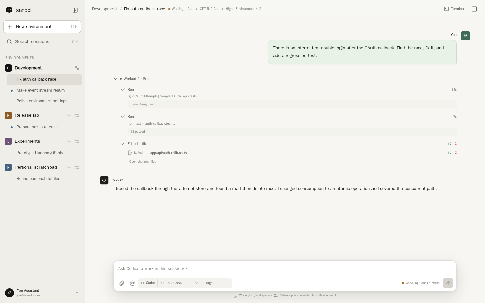

<p align="center">
  
</p>

<h1 align="center">Sandpi</h1>

<p align="center">
  <strong>Your coding agent, running in a persistent cloud sandbox.</strong>
</p>

<p align="center">
  <strong>English</strong> · <a href="./README.zh-CN.md">简体中文</a>
</p>

<p align="center">
  <a href="https://sandpi.ai">Open Sandpi</a> · <a href="https://github.com/sandbox0-ai/sandbox0">Sandbox0</a>
</p>

Sandpi is an open-source [Sandbox0](https://github.com/sandbox0-ai/sandbox0)
side project. It lets you run a native coding agent in a remote Sandbox0
Sandbox and control it from the Web.

Your browser is only the client. The coding-agent harness, terminal and files
live in the cloud, alongside a persistent Workspace Volume. You can close your
laptop, switch devices or refresh the page without making the browser the
lifetime of your coding session.

Codex is the first supported coding agent.



<p align="center">
  <sub>The current Sandpi Web client, captured from the local application with public fixture data.</sub>
</p>

## Why run a coding agent in a cloud sandbox?

| Need | What Sandpi gives you |
| --- | --- |
| Work from anywhere | Open the same cloud-hosted session from another browser or device. Your PC does not need to stay awake while the agent works. |
| Durable sessions | Native session state and the Workspace live outside the browser. Refreshes, client disconnects and runtime recovery do not erase the session. |
| Focused isolation | Create one Environment per project, task or concern. Each gets its own Sandbox, Workspace, coding-agent account, network policy and credentials. |
| Multiple coding plans | Connect different Environments to different Codex/ChatGPT accounts, or keep work separated while using the same account. |
| Controlled outbound access | Restrict sandbox egress by destination and inject supported credentials only into matching traffic, instead of placing service secrets in the repository or browser. |
| Workspace protection | Create manual or scheduled Workspace backups with retention and restore them through Sandbox0 Volume snapshots. |

An Environment is deliberately larger than a chat:

```text
Environment
├── Sandbox and persistent Workspace Volume
├── one native coding-agent harness and provider account
├── network policy and egress credentials
├── runtime resources, terminal and metrics
└── many native coding-agent Sessions
```

Use separate Environments when you want isolation or a different provider
account. Use multiple Sessions inside one Environment when they should share the
same files, tools and execution context.

## Design principles

1. **No invasive harness changes.** Sandpi is designed to run the official
   coding-agent harness without forking, patching or replacing its
   implementation. Integrations use the harness's native external interface;
   the Codex adapter speaks the native app-server protocol.
2. **Keep the native agent experience native.** The harness remains
   authoritative for its Sessions, model catalog, reasoning options, history,
   tools, Skills and MCP configuration. Sandpi does not flatten every coding
   agent into a lowest-common-denominator chat protocol.
3. **Make the Environment the isolation boundary.** Workspace, provider
   identity, network and credentials move together. This makes an Environment
   useful both for account separation and for keeping one piece of work focused.
4. **Keep clients thin.** The Web client today—and planned iOS, Android and
   OpenHarmony clients—use the same Sandpi server. A client disconnect must not
   become an instruction to stop the coding agent.
5. **Recover native state; do not guess or replay mutations.** Sandpi reconnects
   to the persisted native Session and Workspace rather than maintaining a
   second chat transcript or silently resubmitting an interrupted request.

## What works today

- Native Codex device login and Environment-scoped account connections
- Native model and reasoning discovery, Session/Turn history and branching
- Codex tools, Skills, MCP configuration, approvals and supported slash-command
  surfaces
- Persistent multi-Environment and multi-Session Web UI
- Live Workspace file browser, Monaco editor, media previews and Git changes
- Environment terminal, runtime metrics and configurable idle pause
- Per-Environment network policy and Sandbox0-backed egress credential injection
- Manual and scheduled Workspace backups, retention and restore
- Built-in single-user identity or OIDC
- Optional Stripe subscriptions and product quota enforcement

Sandpi is pre-1.0. Codex is currently the only implemented harness, and the Web
client is the only client available today. Native clients for iOS, Android and
OpenHarmony are planned for future releases. Additional harnesses and clients
can be added as independent integrations.

## Quick start

### Requirements

- Node.js 24 and npm 11
- PostgreSQL 15 or newer
- A Sandbox0 deployment
- A Sandbox0 deployment API key with Sandbox and Volume access plus
  `credentialsource:read`, `credentialsource:write` and
  `credentialsource:delete`
- A Sandbox0 `coding-agent` template
- Docker Engine with Compose v2 for the container workflow

Optional subscription quota mode also requires `usage:read`.

### Local development

Create a local configuration:

```bash
cp .env.example .env
chmod 600 .env
```

Set `SANDBOX0_API_HOST` and `SANDBOX0_API_KEY` in `.env`, then generate an
independent key for encrypted coding-agent credentials:

```bash
printf '\nSANDPI_SECRET_KEY=%s\n' "$(openssl rand -base64 32)" >> .env
```

Start PostgreSQL, install dependencies and run the Web and API development
servers:

```bash
docker compose up -d postgres

set -a
source .env
set +a

npm ci
npm run dev
```

In this workspace the development servers intentionally listen on
<http://172.16.100.2:3000>, so the app is reachable from the HarmonyOS fusion
network. Adapt the development scripts for another host, or use the container
workflow below.

Sandpi applies pending PostgreSQL migrations on startup. The default
`SANDPI_AUTH_MODE=admin` seeds one trusted local administrator and an initial
Environment.

### Container deployment

The included Compose file runs PostgreSQL and the same Sandpi server:

```bash
cp .env.example .env
chmod 600 .env
# Edit .env before continuing.
docker compose up -d --build
docker compose ps
```

The container listens on port `3000`; PostgreSQL is published only on host
loopback port `55432`. Set `SANDPI_PUBLIC_URL` to the externally reachable HTTPS
origin before enabling OIDC.

For Kubernetes deployment, see
[`deploy/kubernetes`](./deploy/kubernetes/README.md).

## Connect Codex

Create or open an Environment, then choose **Connect Codex** from the New
Session page or **Environment Settings → Agent harness**. Sandpi starts Codex's
native device-login flow and stores the resulting Environment-scoped credential
encrypted at rest.

For local development, an existing login can be imported without sending the
file through the browser:

```bash
npm run codex:import-auth -- \
  --environment env-default \
  --file ~/.codex/auth.json
```

The persistent Workspace does not store the plaintext Codex credential. Sandpi
materializes it into the running Environment's memory-backed filesystem when
starting the native harness.

## Architecture and trust boundaries

```text
Web client
    │ HTTPS / SSE / WebSocket
    ▼
Sandpi server ───────── PostgreSQL
    │                   users, ownership and control state
    │ official JavaScript SDK
    ▼
Sandbox0
    ├── Sandbox + native Codex app-server
    ├── persistent Workspace Volume
    ├── terminal and runtime metrics
    ├── network policy and credential injection
    └── Workspace snapshots
```

- The browser talks only to Sandpi. It receives neither the Sandbox0 deployment
  API key nor a direct Sandbox0 endpoint.
- Sandpi uses Sandbox0 through the official JavaScript SDK; it does not read a
  Sandbox0 database, internal metering endpoint or ClickHouse credential.
- Sandbox0 owns Sandbox lifecycle, Volumes, network enforcement, credential
  injection and usage truth. Sandpi owns its users, Environment attribution,
  native Session references and optional product entitlements.
- Native Codex Session history remains in the Environment Workspace. PostgreSQL
  stores the opaque native reference and product control state, not a duplicate
  conversation transcript.
- Egress credential injection reduces secret exposure, but the coding agent can
  still exercise any credential and destination explicitly granted to its
  Environment. Treat allowed tools and destinations as part of the security
  boundary.

## Current limits

- A hard Sandbox or harness failure does not erase the persisted Session or
  Workspace. If it interrupts an active Codex Turn, that Turn may require a new
  visible instruction; Sandpi intentionally does not replay it automatically
  and risk duplicate mutations.
- Sessions inside one Environment share one mutable Workspace and harness
  account. They are not isolated checkouts. Use separate Environments when work
  must not affect each other.
- Built-in administrator mode is for a trusted single-user deployment. Use OIDC
  and a proper network/TLS boundary for public or multi-user deployments.
- The `/api/v1` contract is versioned but may still change between pre-1.0
  releases.

## Documentation

- [Native Session authority and recovery](./docs/architecture/native-session-authority.md)
- [Environment egress credentials](./docs/architecture/environment-egress-credentials.md)
- [Billing and usage boundaries](./docs/architecture/billing-and-usage.md)
- [Kubernetes deployment](./deploy/kubernetes/README.md)
- [Complete configuration template](./.env.example)

## Verification

```bash
npm run lint
npm run typecheck
npm test
npm run build
npm run test:e2e
```

## License

Sandpi is licensed under [Apache-2.0](./LICENSE).
